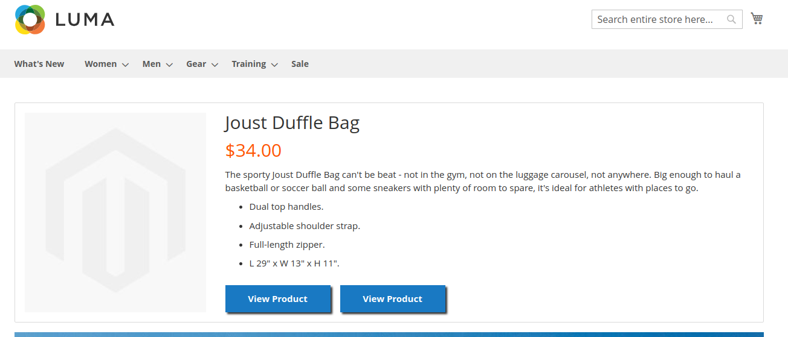
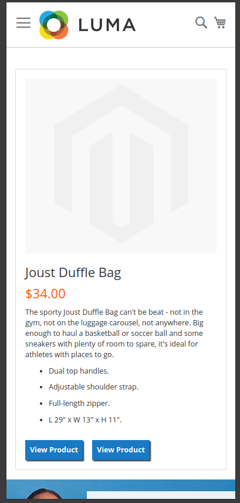
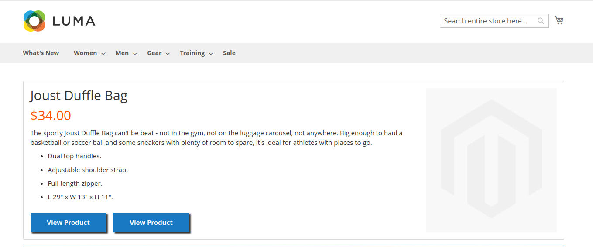
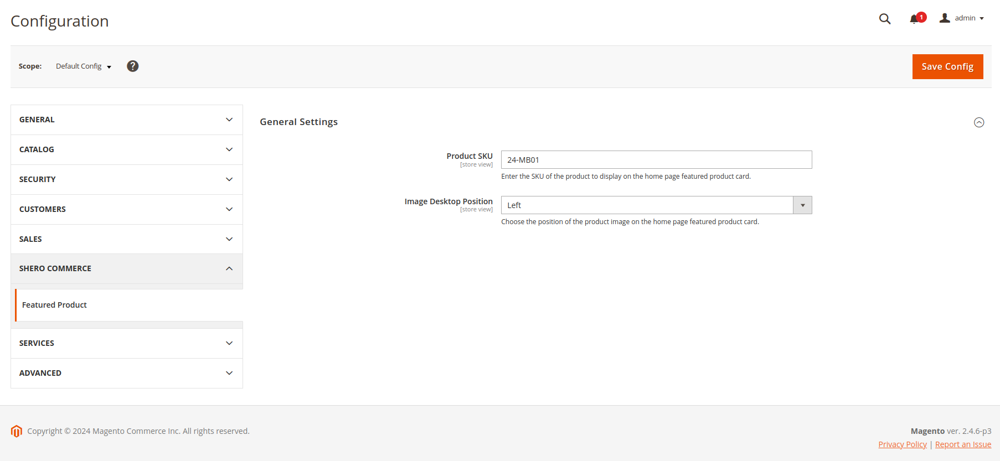

---

# FeaturedProduct Module

This Magento 2 module adds a custom featured product block to the homepage, with configurable options for SKU and image placement.

## Features

- **Product SKU Configuration**: Set the featured product SKU directly from the admin panel via the system configuration.
- **Image Placement Option**: Choose where the product image appears on desktop view — either on the left or the right of the product details.
- **Responsive Design**: The block is fully responsive, with a two-column layout on desktop and a one-column layout on mobile.
- **No SKU? No Block!**: If no SKU is set in the configuration, the block will not be displayed.
  
## Requirements

- **Magento Version**: Tested on Magento 2.4.6-p3.
- **PHP Version**: Compatible with PHP 8.0+ (tested on PHP 8.1).

## Installation

### Type 1: Zip file

 - Unzip the zip file in `app/code/SheroCommerce`
 - Enable the module by running `php bin/magento module:enable SheroCommerce_FeaturedProduct`
 - Apply database updates by running `php bin/magento setup:upgrade`\*
 - Flush the cache by running `php bin/magento cache:flush`

### Type 2: Composer

 - Install the module composer by running `composer require sherocommerce/module-featuredproduct`
 - Enable the module by running `php bin/magento module:enable SheroCommerce_FeaturedProduct`
 - Apply database updates by running `php bin/magento setup:upgrade`\*
 - Flush the cache by running `php bin/magento cache:flush`

## Configuration

After installation, the module can be configured via the Magento admin panel:
- Navigate to **Stores** > **Configuration** > **Shero Commerce** > **Featured Product**.
- **Product SKU**: Enter the SKU of the featured product you want to display.
- **Image Placement**: Select "Left" or "Right" to determine where the product image will appear relative to the details on the desktop version.

## Notes

- **CSS BEM Methodology**: The LESS styles follow the BEM methodology for better structure and maintainability.
- **PHPCS Standard**: Applied Magento2 PHPCS coding standards.
- **General vs Specific Classes**: I intended to create more general classes, but those are better suited for theme-level scope.

## Screenshots

1. **Desktop Layout - Image on the Left:**
   
   

2. **Mobile Layout:**
   
   

3. **Desktop Layout - Image on the Right:**
   
   

4. **Product Configuration:**
   
   

